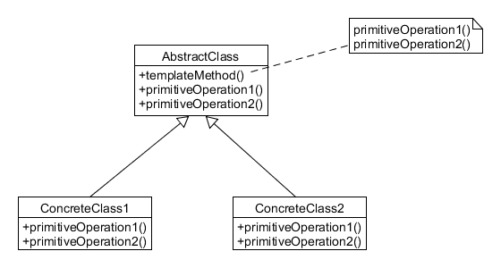
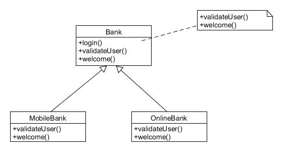
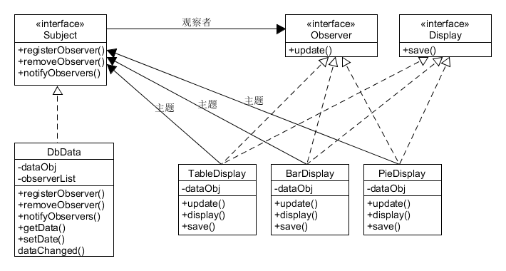

[TOC]

# 问答题与编程题

## 真题一

### 问答题

**问题：**

1. 接口和抽象类有什么区别？
2. 实现多线程的方法有哪几种？
3. 利用递归求6!。
4. 用Java语言实现一个观察者模式。
5. 一个有10亿条记录的文本文件，已按照关键字排好序存储，请设计一个算法，可从文件中快速查找指定关键字的记录。

**解答：**

1. 接口和抽象类是支持抽象类定义的两种机制。二者具有很大的相似性，甚至在某些时候可以互换。但二者也具有很大区别。
具体而言，接口是公开的，里面不能有私有的方法或变量，是用于让别人使用的，而抽象类是可以有私有方法或私有变量的。在Java语言中，可以通过把类或者类中的某些方法声明为`abstract`（`abstract`不能用于修饰属性）来表示一个类是抽象类。接口就是指一个方法的集合，接口中所有方法都没有方法体（1.8后可以定义方法的默认实现）。在Java中接口是通过关键字`interface`来实现的。
包含一个或多个抽象方法的类就必须被声明为抽象类，抽象类可以声明方法的存在而不去实现它，被声明为抽象的方法不能包含方法体。在抽象类的子类中，实现方法必须含有相同的或者更高的访问级别。抽象类在使用的过程中不能被实例化，但是可以创建一个对象使其指向具体子类的一个实例。抽象类的子类为父类中所有抽象方法提供具体的实现，否则，它们也是抽象类。接口可以被看做是抽象类的变体，接口中所有的方法都是抽象的（1.8后可以定义方法的默认实现，即不再抽象），可以通过接口来间接地实现多重继承。接口中的成员变量均为`static final`的，成员变量可以使用`public`修饰。
接口与抽象类的不同点如下：
    - 接口只有定义，不能有方法的实现（1.8后可以定义方法的默认实现），而抽象类中可以定义具有实现的方法。
    - 使用`implements`实现接口，使用`extends`继承抽象类。一个类可以实现多个接口，但一个类只能继承一个抽象类。
    - 接口强调特定功能的实现，其设计理念是“like-a”关系，而抽象类强调所属关系，其设计理念为“is-a”关系。
    - 接口中定义的成员变量默认为`public static final`，只能够有静态的不能被修改的数据成员，而且，必须给其赋初值。而抽象类的成员变量默认为`default`，当然也可以被定义为`private`、`protected`和`public`。
    - 接口被运用于实现比较常用的功能，便于日后维护或者添加删除方法，而抽象类更倾向于充当公共类的角色，不适用于日后重新对里面的代码进行修改。
2. 三种方法：
    - 实现`Runnable`接口，并实现接口中的`run()`方法。
    ```java
    public class ImplRunnable implements Runnable {

        @Override
        public void run() {
            System.out.println("Thread body");
        }
        
        @Test
        public void testCase() {
            new Thread(new ImplRunnable()).start();
        }
    }
    ```
    - 继承`Thread`类，重写`run()`方法。
    ```java
    public class ExtendsThread extends Thread {

        @Override
        public void run() {
            System.out.println("Thread body");
        }

        @Test
        public void testCase() {
            new ExtendsThread().start();
        }
    }
    ```
    - 实现`Callable`接口，重写`call()`方法。
    ```java
    public class ImplCallable implements Callable<String> {

        @Override
        public String call() throws Exception {
            return "Hello World";
        }
        
        @Test
        public void testCase() {
            ExecutorService executor = Executors.newSingleThreadExecutor();
            Future<String> future = executor.submit(new ImplCallable());
            try {
                System.out.println(future.get());
            } catch (InterruptedException e) {
                e.printStackTrace();
            } catch (ExecutionException e) {
                e.printStackTrace();
            }
        }
    }
    ```
3. 答案如下：
```java
public int fac(int n) {
    return n == 1 ? 1 : n * fac(n - 1);
}
```
4. 实现如下：
```java
// Subject
interface Subject {
    void registerObserver(Observer o);
    void removeObserver(Observer o);
    void notifyObservers();
}

// ConcreteSubject
class Weather implements Subject {
    
    private List<Observer> observers = new ArrayList<>();
    
    private double temperature;

    public void weatherChange() {
        notifyObservers();
    }
    
    public double getTemperature() {
        return temperature;
    }

    public void setTemperature(double temperature) {
        this.temperature = temperature;
        notifyObservers();
    }

    @Override
    public void registerObserver(Observer o) {
        observers.add(o);
    }

    @Override
    public void removeObserver(Observer o) {
        observers.remove(o);
    }

    @Override
    public void notifyObservers() {
        for (Observer observer : observers) {
            observer.update(temperature);
        }
    }
}

// Observer
interface Observer {
    void update(double temperature);
}

// ConcreteObserver
class WeatherDisplay1 implements Observer {

    private double temperature;
    
    public WeatherDisplay1(Subject weather) {
        weather.registerObserver(this);
    }
    
    @Override
    public void update(double temperature) {
        this.temperature = temperature;
        display();
    }
    
    public void display() {
        System.out.println("display1***** : " + temperature);
    }
}

// ConcreteObserver
class WeatherDisplay2 implements Observer {

    private double temperature;
    
    public WeatherDisplay2(Subject weather) {
        weather.registerObserver(this);
    }
    
    @Override
    public void update(double temperature) {
        this.temperature = temperature;
        display();
    }
    
    public void display() {
        System.out.println("display1----- : " + temperature);
    }
}

public class ObserverPattern {
    @SuppressWarnings("unused")
    public static void main(String[] args) {
        Weather weather = new Weather();
        WeatherDisplay1 display1 = new WeatherDisplay1(weather);
        WeatherDisplay2 display2 = new WeatherDisplay2(weather);
        weather.setTemperature(27);
        weather.setTemperature(20);
    }
}
```
5. 如果有足够大的内存，则可以一次性读入全部数据，然后进行查找。如果无法一次性将全部信息读入，则需要将数据进行分解。例如将数据分为100份，把每份的第一条记录关键字和此记录对应的文件偏移量先读入内存，然后根据指定关键字定位出指定关键字所在的记录块，将相应的记录块读入内存，最后进行二分查找。

## 真题二

### 问答题

**问题：**

1. `List<? extends T>`和`List<? super T>`之间有什么区别？
2. 给出两种单例模式的实现方法，并说明这两种方法的优缺点。
3. 描述Java语言中抽象基类和接口各自主要使用的场景。
4. `int`和`Integer`的区别是什么？
5. 已知和两个链表`head1`和`head2`各自有序，请把它们合并成一个依然有序的链表。结果链表要包含`head1`和`head2`的所有结点，即结点值相同。
6.给定a、b两个文件，各存放50亿个url，每个url各占64B，内存限制是4GB，请找出文件a与文件b中共同的url。

**解答：**

1. `List<? extends T>`只能读数据，不能存数据。`List<? super T>`可以存入数据，存入数据需要是类型`T`或者其子类类型。读取时只能使用`Object`类型进行接收。PECS原则：生产者（Producer）使用`extends`，消费者（Consumer）使用`super`。即频繁往外读取内容的，适合用上界`extends`，经常往里插入的，适合用下界`super`。
```java
public static <T> void copy(List<? super T> dest, List<? extends T> src) {
    for (int i = 0; i < src.size(); i++) {
        dest.set(i, src.get(i));
    }
}
```
2. 四种方法：
    - 饿汉式，线程安全：
    ```java
    public class Singleton {
        private static Singleton INSTANCE = new Singleton();
        private Singleton() {}
        public static Singleton getInstance() {
            return INSTANCE;
        }
        
        public static void main(String[] args) {
            Singleton s1 = getInstance();
            Singleton s2 = getInstance();
            System.out.println(s1 == s2);
        }
    }
    ```
    - 懒汉式I，线程安全，锁粒度较大：
    ```java
    public class SingletonLazyI {

        private static SingletonLazyI INSTANCE;
        private SingletonLazyI () {}
        public static synchronized SingletonLazyI getInstance() {
            if (INSTANCE == null) {
                INSTANCE = new SingletonLazyI();
            }
            return INSTANCE;
        }
        
        public static void main(String[] args) {
            SingletonLazyI s1 = getInstance();
            SingletonLazyI s2 = getInstance();
            System.out.println(s1 == s2);
        }
    }
    ```
    - 懒汉式II，线程安全，锁粒度较小：
    ```java
    public class SingletonLazyII {
        private static SingletonLazyII INSTANCE;
        private SingletonLazyII() {}
        public static SingletonLazyII getInstance() {
            if (INSTANCE == null) {
                synchronized (SingletonLazyII.class) {
                    if (INSTANCE == null) {
                        INSTANCE = new SingletonLazyII();
                    }
                }
            }
            return INSTANCE;
        }
        
        public static void main(String[] args) {
            SingletonLazyII s1 = getInstance();
            SingletonLazyII s2 = getInstance();
            System.out.println(s1 == s2);
        }
    }
    ```
    - 使用枚举，线程安全：
    ```java
    public class SingletonEnum {
        
        private SingletonEnum() {}
        
        public static SingletonEnum getInstance() {
            return Singleton.INSTANCE.getInstance();
        }
        
        private static enum Singleton {
            INSTANCE;
            private SingletonEnum singleton;
            private Singleton() {
                singleton = new SingletonEnum();
            }
            public SingletonEnum getInstance() {
                return singleton;
            }
        }
        
        public static void main(String[] args) {
            SingletonEnum s1 = getInstance();
            SingletonEnum s2 = getInstance();
            System.out.println(s1 == s2);
        }

    }
    ```
3. 接口是一种特殊形式的抽象类，使用接口完全有可能实现与抽象类相同的操作，但一般而言，抽象类多用于在同类事物中有无法具体描述的方法的场景，所以，当子类和父类之间存在有逻辑上的层次结构时，推荐使用抽象类，而接口多用于不同类之间，定义不同类之间的通信规则。所以，当希望支持差别较大的两个或者更多对象之间的特定交互行为时，应该使用接口。使用接口能大大降低软件系统的耦合度。
4. `int`和`Integer`的区别如下：
    - `int`是基本数据类型，其默认值为0。`Integer`是`int`的包装类，默认值为`null`。`int`无法区分未赋值与赋值为0的情况，而`Integer`可以。
    - `int`类型在传递时是值传递，而`Integer`是引用传递。
    - `int`类型只能用于运算，而`Integer`类提供许多有用的方法。
    - 容器类无法存放`int`类型，只能存放`Integer`类型。
5. 两种答案：
    - 递归：
    ```java
    public ListNode merge(ListNode head1, ListNode head2) {

        if (head1 == null) {
            return head2;
        }

        if (head2 == null) {
            return head1;
        }

        ListNode dummy = new ListNode(-1);
        ListNode curr = dummy;
        if (head1.val < head2.val) {
            curr.next = head1;
            curr = curr.next;
            curr.next = merge(head1.next, head2);
        } else {
            curr.next = head2;
            curr = curr.next;
            curr.next = merge(head1, head2.next);
        }
        return dummy.next;
    }
    ```
    - 循环：
    ```java
    public ListNode merge(ListNode head1, ListNode head2) {

        ListNode dummy = new ListNode(-1);
        ListNode curr = dummy;

        while (head1 != null && head2 != null) {
            if (head1.val < head2.val) {
                curr.next = head1;
                head1 = head1.next;
            } else {
                curr.next = head2;
                head2 = head2.next;
            }
            curr = curr.next;
        }

        curr.next = head1 == null ? head2 : head1;
        return dummy.next;
    }
    ```
6. 两种方案：
    - Hash法：首先遍历文件a，对每个url求hash值并散列到1000个文件中，即`h = hash(url) % 1000`，然后将结果文件存放到文件fa中。通过散列，所有的url将会分布在fa0、fa1、...、fa999这1000个文件中。同理，将文件b中的url也进行同样的散列，所有的url将会分布在fb0、fb1、...、fb999这1000个文件中。显然，与fa0中相同的url只可能存在与fb0中，因此只需要分别找出文件$fa_i$和$fb_i$中相同的url即可。
    - Bloom filter法：该方法的接单具体参见原书P127页。

## 真题三

### 问答题

**问题：**

1. 接口能否继承接口？抽象类是否可以实现接口？抽象类是否可继承实体类？
2. 面向对象的特征有哪些方面？
3. `String`和`StringBuffer`有什么区别？
4. `final`、`finally`和`finalize`的区别是什么？
5. `ArrayList`、`Vector`和`LinkedList`有什么特点？`HashMap`和`Hashtable`有什么区别？

**解答：**

1. 接口可以继承接口；抽象类可以实现接口；抽象类可以继承实体类。
2. 四个特征：
    - 抽象：抽象就是忽略一个主题中与当前目标无关的那些方面，以便更充分地注意与当前目标有关的方面。抽象并不打算了解全部问题，而只是选择其中的一部分，暂时不用关注细节。抽象包含两个方面内容，一是过程抽象，二是数据抽象。
    - 继承：继承是一种联结类的层次模型，并且允许和鼓励类的重用，它提供了一种明确表述共性的方法。对象的一个新类可以从现有类中派生，这个过程称为类继承。新类继承了原始类的特性，新类称为原始类和派生类，而原始类称为新类的基类。派生类可以从它的基类哪里继承方法和实例变量，并且子类可以修改或增加新的方法使之更适合特殊的需要。
    - 封装：封装是指将客观事物抽象成类，每个类对自身的数据和方法实行保护。类可以把自己的数据和方法只让可信的类或者对象操作，对不可信的进行信息的隐藏。
    - 多态：封装是指允许不同类的对象对同一消息做出响应。多态包括参数化多态和包含多态。 
3. `String`是不可变类，而`StringBuffer`是可变类。`String`是不可变类，也就是说，`String`对象一旦被创建，其值将不能被改变，而`StringBuffer`是可变类，对象被创建后，仍然可以对其值进行修改。如果一个字符串经常需要被修改的时候，使用`StringBuffer`，使用`StringBuffer`有更高的效率。
4. 区别如下：
    - `final`：用于声明属性、方法和类
        + `final`属性：被`final`修饰的变量不可变，其不可变指的是引用的不可变性，即它只能指向初始时指向的那个对象，而不关心指向对象的内容的变化。所以，被`final`修饰的变量必须被初始化。
        + `final`方法：被`final`声明的方法无法被子类重写。
        + `final`参数：用来表示这个参数在这个方法内部不允许被修改。
        + `final`类：当一个类被声明为`final`时，表示此类不能被继承，所有方法都不能被重写。
    - `finally`：`finally`作为异常处理的一部分，它只能用在`try/catch`语句中，并且附带这一个语句块，表示这段语句最终一定会被执行。
    - `finalize`：`finalize`是`Object`类的一个方法，在垃圾收集器执行的时候会调用被回收对象的`finalize()`方法，可以覆盖此方法来实现对其他资源的回收。
5. 解答：
    - `ArrayList`、`Vector`和`LinkedList`的特点：
        + `ArrayList`：内部使用数组实现，支持使用下标进行检索。由于内部使用数组实现，所以查找数据的速度较快，但插入数据的速度较慢。动态扩充数组大小时会默认扩充为原来的1.5倍，即`int newCapacity = oldCapacity + (oldCapacity >> 1);`。
        + `Vector`：内部使用数组实现，同样支持使用下标进行检索。`Vector`是线程安全的，其绝大部分方法均被`synchronized`修饰，这也导致其效率比`ArrayList`略低。动态扩充数组大小时会默认扩充为原来的2倍，同时可以设置每次扩充的大小。`int newCapacity = oldCapacity + ((capacityIncrement > 0) ?                    capacityIncrement : oldCapacity);`
        + `LinkedList`：内部使用双向链表实现，不能使用索引进行数据的查找。查找数据的效率较低，插入数据的效率较高，因为在插入数据时不需要对数据进行移动。
    - `HashMap`和`Hashtable`区别：
        + `HashMap`是非线程安全的，`Hashtable`是线程安全的。
        + `HashMap`允许空键、空值，`Hashtable`不允许空键、空值。
        + `HashMap`将`Hashtable`的`contains`方法去掉了，改成了`containsValue`和`containKey`。
        + `HashMap`继承自`AbstractMap`，`Hashtable`继承自`Dictionary`。
        + `HashMap`使用`Iterator`遍历，`Hashtable`使用`Enumeration`遍历。
        + `HashMap`的默认大小是16，`Hashtable`的默认大小是11。

### 附加题

**问题：**

1. 编写一个截取字符串的函数，输入为一个字符串和字节数，输出为按字节街区的字符串。但是要保证汉字不被截半个，例如“人ABC” 4，应该截为“人AB”，输入“人ABC们DEF” 6，应该输出为“人ABC”而不是“人ABC+们的半个”。
2. 排序有哪几种方法？用Java语言实现一个插入排序？

**解答：**

1. 代码如下：
```java
// 对Java而言，用char类型表示汉字时需要两个字节，表示英文字母时需要一个字节。
public String cut(String s, int b) {
    
    if (b == 0) {
        return "";
    }

    StringBuilder sb = new StringBuilder();
    int count = 0;
    for (char c : s.toCharArray()) {
        if (count < b) {
            if (String.valueOf(c).getBytes().length > 1) {
                if (count + 1 == b) {
                    return sb.toString();
                }
                count += 2;
            } else {
                ++count;
            }
            sb.append(c);
        } else {
            break;
        }
    }
    return sb.toString();
}
```
2. 排序方法主要有：插入排序、选择排序、希尔排序、快速排序、堆排序、归并排序、基数排序、桶排序。
插入排序实现：
```java
public static <T extends Comparable<? super T>> void sort(T[] a) {
    int N = a.length;
    for (int i = 1; i < N; i++) {
        for (int j = i; j > 0; j--) {
            if (less(a[j], a[j - 1])) {
                exch(a, j, j - 1);
            } else {
                break;
            }
        }
    }
}

private static <T extends Comparable<? super T>> boolean less(T v, T w) {
    return v.compareTo(w) < 0;
}

private static <T> void exch(T[] a, int i, int j) {
    T t = a[i];
    a[i] = a[j];
    a[j] = t;
}
```

## 真题四

### 简答题

**问题：**

1. `HashMap`和`Hashtable`的区别是什么？
2. `&`和`&&`的区别是什么？
3. `Collection`和`Collections`的区别是什么？
4. `abstract class`和`interface`的区别是什么？
5. `final`、`finally`和`finalize`的区别是什么？

**解答：**

1. 参见真题三问答题中问题5的答案。
2. `&`是按位与运算符，将运算的双方转为二进制后，再按位进行与运算。`&&`为逻辑与运算符，当且仅当运算的双方均为`true`时，运算的结果为`true`。`&&`具有短路功能。
3. `Collection`是一个集合接口。它提供了对集合对象进行基本操作的通用接口方法。该接口的设计目标是为各种具体的集合提供最大化的统一的操作方法。`Collections`是针对集合类的一个工具类，它提供一系列静态方法来实现对各种集合的搜索、排序以及线程安全化等操作。
4. 参见真题一中问题1的答案。
5. 参见真题三问答题中问题4的答案。

### 加分题

**问题：**

1. 什么是设计模式？有哪些常见的设计模式？
2. 请简要介绍Spring MVC、IoC和AOP。

**解答：**

1. 设计模式是一套被反复使用、多数人知晓的、经过分类编目的、代码设计经验的总结。使用设计模式的目的是为了代码的重用，避免程序大量修改，同时使代码更容易被他人理解，并且保证代码的可靠性。显然，设计模式不管是对自己还是对他人还是对系统都是有益的，设计模式使得代码编制真正地工程化。GoF的23种设计模式如下：
    - 创建型：
        + 工厂方法模式
        + 抽象工厂模式
        + 生成器模式
        + 原型模式
        + 单例模式
    - 结构型：
        + 适配器类模式
        + 适配器对象模式
        + 桥接模式
        + 组合模式
        + 装饰模式
        + 外观模式
        + 享元模式
        + 代理模式
    - 行为型：
        + 解释器模式
        + 模板方法模式
        + 职责链模式
        + 命令模式
        + 迭代器模式
        + 中介者模式
        + 备忘录模式
        + 观察者模式
        + 状态模式
        + 策略模式
        + 访问者模式
2. 答案：
    - Spring MVC是在Spring框架上发展而来的框架，它提供了构建Web应用程序的全功能MVC模块。对于Spring MVC框架而言，它把控制器、模型、分派器以及处理程序对象的角色进行了分离，因此Spring MVC有很好的可定制性。
    - IoC（Inverse of Control，控制反转）有时也被称为依赖注入，是一种降低对象之间耦合关系的设计思想。一般而言，在分层体系结构种，都是上层调用下层的接口，上层依赖于下层的执行，即调用者依赖于被调用者。而通过IoC方式，使得上层不再依赖于下层的接口，即通过采用一定的机制来选择不同的下层实现，完成控制反转，使得由调用者来决定被调用者。IoC通过注入的一个实例化的对象来达到解耦的目的。使用这种方法后，对象不会被显式地调用，而是根据需求通过IoC容器来提供。
    - AOP（Aspect-Oriented Programming，面向切面编程）是对面向对象开发的一种补充，它允许开发人员在不改变原来模型的基础上动态地修改模型从而满足新的需求。

## 真题五

### 简答题

**问题：**

1. 关键字`static`的作用是什么？
2. JSP和Servlet有哪些相同点和不同点？它们之间的联系是什么?
3. `switch`是否能作用在`byte`上？是否能作用在`long`上？是否能作用在`String`上？
4. 数据库连接池的工作机制是什么？
5. 多线程同步有几种实现方法？
6. HTML的`Form`和`XForm`的区别是什么？
7. `forward`和`redirect`的区别是什么？
8. Overload和Override的区别是什么？Overload的方法是否可以改变返回值的类型？
9. 下面的Java代码保存在B.java文件中是否合法？
```java
class A {
    public static void main(String[] args) {
        System.out.println("Hello World");
    }
}
```
10. Servlet和CGI的区别是什么？

**解答：**

1. `static`可用来修饰成员变量、成员方法、代码块、内部类，还可用来进行静态导入。
    - 修饰成员变量：可以通过使用`static`来使得变量被类拥有，所有的对象都共享这个静态变量。对静态变量的引用有两种方式，分别为“类.静态变量”和“对象.静态变量”。
    - 修饰成员方法：被`static`修饰的方法将成为类的方法，不需要创建对象就可以被调用。静态方法中不能使用`this`和`super`关键字，在没有实例化相关对象时不能调用非静态方法，同样地也不能访问非静态变量。
    - 修饰代码块：静态代码块是类中独立于成员变量和成员方法的代码块。它不在任何一个方法体内。JVM在加载类的时候会执行静态代码块，静态代码块只会被执行一次。静态代码块通常被用来初始化静态变量。
    - 修饰内部类：被`static`修饰的内部类，可以不依赖于外部类实例对象而被实例化，而通常的内部类需要在外部类实例化后才能实例化。
    - 静态导入：使用静态导入可以不通过调用包名，直接使用包里的静态方法。
2. 相同点和不同点：
    - 相同点：JSP可以被看作是一个特殊的Servlet，它是对Servlet的扩展，只要是JSP可以完成的工作，使用Servlet都可以完成。由于JSP页面最终要被转为Servlet来运行，因此处理实际请求的实际上还是Servlet。
    - 不同点：Servlet的实现方式是在Java语言中嵌入HTML代码，编写和修改HTML非常不方便，所以它更适合做流程控制和业务处理。而JSP的实现方式为在HTML中嵌入Java代码，比较适合页面的显示；Servlet中没有内置对象，JSP中具有内置对象。
3. 只有能够被转为`int`类型的变量或是`String`和`enum`类型的变量才能用作`switch`语句的key。所以`long`类型不可以，而`byte`和`String`可以。
4. 数据库连接池负责分配、管理并释放数据库链接，它允许应用程序重复使用一个现有的数据库链接，而不是再重新建立一个新的数据库链接。同时，它还负责释放空闲时间超过最大空闲时间的数据库链接，避免因为没有释放数据库而引发的数据库链接泄漏。在J2EE中，服务器启动时就会创建具有一定链接数量的连接池。当客户程序需要访问数据库时，就可以从池中获取链接，而不用创建新的链接，同时将该链接标记为繁忙状态。当使用完毕后会再将该链接标记为空闲状态，使得其他程序可以获取该链接。
5. 有如下几种方式：
    - 使用`synchronized`关键字。在Java语言中，每个对象都有一个对象锁与之关联，该锁表明对象在任何时候只允许被一个线程所拥有，当一个线程调用对象的一段`synchronized`代码时，首先需要获取这个锁，然后才能执行相应的代码，执行结束后，锁被释放。`synchronized`关键字主要有两种用法：
        + `synchronized`方法：在方法的声明前加入`synchronized`关键字，这样就可以确保这个方法在同一时刻只能被一个线程来访问，从而保证了多线程访问的安全性。
        + `synchronized`代码块：可以把任意的代码段声明为`synchronized`，并指定上锁的对象，该方法具有更高的灵活性。
    - 使用`wait()`和`notify()`方法：当使用`synchronized`来修饰某个共享资源的时候，如果线程1在执行`synchronized`代码，另外一个线程2也要同时执行同一个对象的`synchronized`代码时，线程2将要等待线程1执行完毕并释放锁后才能执行。这种情况下可以使用`wait()`和`notify()`方法。在执行`synchronized`代码时，线程可以调用对象的`wait()`方法，并释放对象锁，进入等待状态。而且可以使用`notify()`或`notifyAll()`方法通知正在等待的其他线程。`notify()`方法仅唤醒等待队列中的第一个线程，并允许它去获得锁，而`notifyAll()`方法唤醒所有等待这个对象的线程，并允许它们去获得锁。
    - 使用`Lock`：`Lock`也可以用来实现多线程的同步，具体通过`lock()`、`tryLock()`、`tryLock(long timeout, TimeUnit unit)`、`lockInterruptibly()`方法来实现。
6. 相比于`form`，`XForm`是下一代HTML表单标准，它提供更加丰富灵活的表单控件，同时更加规范、可用性更高。它使用XML定义数据，同时也使用XML来存储及传递数据。
7. `forward`是服务器内部的重定向，服务器直接访问目标地址的url，把那个url的响应内容读取过来，而客户端并不知道，因此，在客户端浏览器的地址栏中不会显示转向后的地址，还是原来的地址。由于整个定向过程中用的是同一个请求，因此请求携带的信息会被保留下来。`redirect`则是客户端重定向，是完全的跳转，即相当于重新发出一个新的请求，因此浏览器中会显示跳转后的地址。
8. Overload是重载，重载是指在一个类中定义了多个同名方法，它们具有不同的参数列表。Override是指覆盖，即子类对父类或者接口方法的重写，以达到不同的效果。
9. 合法。因为该类没有被`public`修饰。
10. 主要表现在如下几个方面：
    - 由于Java具有跨平台和可移植性强的特点，所以相比于CGI，Sevrlet也具有较好的移植性。 
    - 由于CGI针对每个请求都会创建一个进程来处理，而Servlet针对每个请求创建一个线程来执行，所以Servlet响应效率更高。
    - Servlet可以与Web服务器进行交互，而CGI则无法与Web服务器进行交互。
    - Servlet提供了许多非常有用的接口用来读取或设置HTTP头消息，处理Cookie和跟踪会话状态。
    - Servlet的可扩展性更强。

### 编程题

**问题：**

1. 对数组进行顺序排序。
2. 用Java语言写一段访问Oracle数据库的程序，并实现数据查询。
3. 请给出单例模式的实现代码。
4. 用循环控制语句打印输出1+3+5+...+99的结果。

**解答：**

1. 这里使用选择排序。
```java
public static <T extends Comparable<? super T>> void sort(T[] a) {
    int N = a.length; 
    for (int i = 0; i < N; i++) {
        int min = i; 
        for (int j = i + 1; j < N; j++) {
            if (less(a[j], a[min])) {
                min = j;
            }
        }
        exch(a, i, min);
    }
}

private static <T extends Comparable<? super T>> boolean less(T v, T w) {
    return v.compareTo(w) < 0;
}

private static <T> void exch(T[] a, int i, int j) {
    T t = a[i];
    a[i] = a[j];
    a[j] = t;
}
```
2. 解答：
```java
public Connection getConnection() {
    Connection conn = null;
    String driver = "oracle.jdbc.driver.OracleDriver";
    String url = "${url}"; // 代表url
    String user = "user";
    String pw = "password";
    try {
        Class.forName(driver);
        conn = DriverManager.getConnection(url, user, pw);
    } catch (ClassNotFoundException e) {
        e.printStackTrace();
    } catch (SQLException e) {
        e.printStackTrace();
    }
    return conn;
}

public void printResult() {
    Connection conn = null;
    PreparedStatement pstat = null;
    ResultSet rs = null;
    conn = getConnection();
    String sql = "${Query}"; // 代表sql语句
    try {
        pstat = conn.prepareStatement(sql);
        rs = pstat.executeQuery();
        while (rs.next()) {
            System.out.println(rs.getString("${columnName}")); // 代表列名
        }
    } catch (SQLException e) {
        e.printStackTrace();
    } finally {
        if (rs != null) {
            try {
                rs.close();
            } catch (SQLException e) {
                e.printStackTrace();
            }
        }
        if (pstat != null) {
            try {
                pstat.close();
            } catch (SQLException e) {
                e.printStackTrace();
            }
        }
        if (conn != null) {
            try {
                conn.close();
            } catch (SQLException e) {
                e.printStackTrace();
            }
        }
    }
}
```
3. 参见真题二问答题中问题2的答案。
4. 解答：
```java
public void sum() {
    int sum = 0;
    for (int i = 1; i < 100; i += 2) {
        sum += i;
    }
    System.out.println("1+3+5+...+99=" + sum);
}
```

## 真题六

### 简答题

**问题：**

1. 为什么不能通过返回值来对方法进行重载？
2. 是否可以用`volatile`来修饰数组？
3. `a=a+b`和`a+=b`有什么不同？
4. 如何查看Java程序使用内存的情况？
5. 四种会话跟踪技术是什么？
6. 在多线程编程的时候有哪些注意事项？

**解答：**

1. 假设两个方法只有返回值不同，其方法名和参数列表均相同，则在对其调用时会出现歧义。
2. 可以。此时`volatile`修饰的数组的引用，而不是数组中的值。
3. 在Java中，当参与运算的两个数是`byte`、`short`或`int`时，它们首先都会被转换为`int`类型，再进行计算。然后把计算的结果赋值给用来存储结果的变量。如果用来存储结果变量的类型是`byte`或`short`，这意味着需要把`int`类型转换为`byte`或`short`类型。`a+=b`会进行隐式转换，将结果转换为`a`的类型。而`a=a+b`不会把`a+b`运算结果进行隐式转换。
4. Java提供了一个`Runtime`类实例用于查看内存使用情况：
```java
public class JVMRuntime {
    public static void main(String[] args) {
        System.out.println(Runtime.getRuntime().freeMemory());
        System.out.println(Runtime.getRuntime().totalMemory());
        System.out.println(Runtime.getRuntime().maxMemory());
        System.out.println(Runtime.getRuntime().availableProcessors());
    }
}
```
5. 四种会话跟踪常用的方法：
    - url重写：URL重写的技术就是在URL结尾添加一个附加数据以标识该会话,把会话ID通过URL的信息传递过去，以便在服务器端进行识别不同的用户。 
    - 隐藏表单域：将会话ID添加到HTML表单元素中提交到服务器,此表单元素并不在客户端显示。 
    - cookie：Cookie是Web服务器发送给客户端的一小段信息，客户端请求时可以读取该信息发送到服务器端，进而进行用户的识别。对于客户端的每次请求，服务器都会将Cookie发送到客户端,在客户端可以进行保存,以便下次使用。 
    - session：每一个用户都有一个不同的session，各个用户之间是不能共享的，是每个用户所独享的，在session中可以存放信息。在服务器端会创建一个session对象，产生一个sessionID来标识这个session对象，然后将这个sessionID放入到Cookie中发送到客户端，下一次访问时，sessionID会发送到服务器，在服务器端进行识别不同的用户。
6. 指导原则：
    - 如果能用`volatile`来代替`synchronized`，尽可能使用`volatile`。因为被`synchronized`修饰的方法或代码块在同一时间值允许一个线程访问，而`volatile`没有这个限制。由于`volatile`无法保证原子操作，因此在多线程的情况下，只有对变量的操作为原子操作的情况下才可以使用`volatile`。
    - 能使用`synchronized`代码块则尽量不要使用`synchronized`方法，并尽可能的减少`synchronized`代码块中的代码，只把临界区对的代码放在块中。
    - 尽可能使用Concurrent容器，这些容器的锁粒度更小。
    - 尽可能给每个线程定义一个名字，避免使用匿名线程。
    - 使用线程池来控制多线程的执行。

### 数据库设计题目

**问题：**

有如下学生信息：

学生表`student(stu_id, stu_name);`
课程表`course(c_id, c_name);`
成绩表`score(stu_id, c_id, score);`

1. 写出向学生表中插入一条数据的SQL语句。
2. 查询名字为James的学生所选的课程。
3. 查询`stu_id`为4的学生所学课程的成绩。

**解答：**

1. 假设`stu_id`是该表的主键，且具有自增属性。`INSERT INTO student (stu_name) VALUES ("Tavish");`
2. `SELECT c.c_name FROM (course c INNER JOIN score sc ON c.c_id = sc.c_id) INNER JOIN student st ON sc.stu_id = st.stu_id WHERE st.stu_name = "James";`
3. `SELECT sc.score FROM score sc INNER JOIN student st ON sc.stu_id = st.stu_id WHERE st.stu_id = 4;`

## 真题七

### 简答题

**问题：**

1. 甲、乙两个人再玩彩数字游戏，甲随机写了一个数字，在[1,100]区间之内，将这个数字写在一张纸上，然后乙来猜。如果乙猜的数字偏小，甲会提示“数字偏小”。一旦乙猜的数字偏大，甲以后就再也不会提示了，只会回答“猜对或猜错”。请问：乙至少猜多少次才可以准确猜出这个数字？在这种策略下，乙猜第一个数字是什么？
2. 请给出Java异常类的继承体系结构，以及Java异常的分类，且为每种类型的异常各举几个例子。
3. 在Web开发中，如何实现会话的跟踪。
4. 描述Java类加载器的原理及其组织结构。
5. 请简述Spring架构中IoC的实现原理。
6. 下面程序是否存在问题？如果存在，请指出问题所在；如果不存在，请说明输出结果。
```java
public class Test {

    public static String result = "";

    public static void f(int i) {
        try {
            if (i == 1) {
                throw new Exception(exception message);
            }
        } catch (Exception e) {
            result += "2";
            return;
        } finally {
            result += "3";
        }
        result += "4";
    }

    public static void main(String[] args) {
        f(0);
        f(1);
        System.out.println(result);
    }
}
```
7. 下面程序是否存在问题？如果存在，请指出问题所在；如果不存在，说明输出结果。
```java
public class HelloB extends HelloA {
    public HelloB() {
        System.out.println("HelloB");
    }
    {
        System.out.println("I'm B class");
    }
    static {
        System.out.println("static B");
    }
    public static void main(String[] args) {
        new HelloB();
    }
}

class HelloA {
    public HelloA() {
        System.out.println("HelloA");
    }
    {
        System.out.println("I'm A class");
    }
    static {
        System.out.println("static A");
    }
}
```
8. 下面程序是否存在问题？如果存在，请指出问题所在；如果不存在，说明输出结果。
```java
public class Test {
    public static void main(String[] args) {
        Test t = new Test();
        int i = 0;
        t.increase(i);
        i = i++;
        System.out.println(i);
    }

    void increase(int i) {
        i++;
    }
}
```
9. 下面程序是否存在问题？如果存在，请指出问题所在；如果不存在，说明输出结果。
```java
public class Test {

    public static void main(String[] args) {
        String str = new String("good");
        char[] ch = {'a', 'b', 'c'};
        Test ex = new Test();
        ex.change(str, ch);
        System.out.print(str + "and");
        System.out.print(ch);
    }

    public void change(String str, char[] ch) {
        str = "test ok";
        ch[0] = 'g';
    }
}
```
10. 下面程序是否存在问题？如果存在，请指出问题所在；如果不存在，说明输出结果。
```java
package package1;
import java.util.Date;

public class Test extends Date {
    public void test() {
        System.out.println(super.getClass().getName());
    }

    public static void main(String[] args) {
        new Test().test();
    }
}
```

**解答：**

1. 答案参见原书P208。
2. Java语言提供了两种错误的处理类，分别为`Error`和`Exception`，且它们具有共同的父类`Throwable`。
`Error`表示程序在运行期间出现了非常严重的错误，且该错误是不可恢复的。当发生此类错误时，JVM会选择终止程序的运行。此外，编译器不会检查`Error`是否被处理，所以通常不用去捕获`Error`类型的异常，即一个正确的程序中是不应该存在`Error`的。`Error`的子类有`OutOfMemoryError`、`NoClassDefFoundError`等。
`Exception`表示可恢复的异常，是编译器可以捕捉到的。它包含两种类型：运行时异常和受检查异常。
    - 运行时异常：对于运行时异常，编译器不强制对其进行捕获并处理。如果不对这种异常进行处理，当出现这种异常时，会由JVM进行处理。常见的运行时异常有`NullPointerException`
    、`ClassCastException`和`IndexOutOfBoundException`等。
    - 受检查异常：对于受检查异常，编译器会强制要求程序去捕获此类型的异常，即把可能会出现这些异常的代码放到`try`块中，把对异常的处理代码放到`catch`块中。这种异常一般在如下的情况中使用，例如异常的发生并不会导致程序出错，进行处理后可以继续执行后序的操作；程序依赖于不可靠的外部条件，例如系统I/O。常见的受检查异常有`SQLException`、`IOException`等。
3. 参见真题六中简答题问题5的答案。
4. Java语言是一种具有动态性的解释型语言，类只有被加载的JVM中后才能运行。当运行程序的时候，JVM会将编译生成.class文件按照需求和一定的规则加载到内存中，并组织成为一个完整的Java应用程序。这个加载过程是由加载器来完成的，具体而言是由`ClassLoader`和它的子类来实现。类加载器本身也是一个类，其实质是将类文件从硬盘读取到内存中。
类的加载方式分为隐式装载与显式装装载两种。隐式装载指的是程序在使用`new`等方式创建对象时，会隐式地调用类的加载器将对应的类加载到JVM中。显式装载指的是通过直接调用`Class.forName()`方法将所需的类加载到JVM中。
任何一个工程项目都是由许多个类组成的，当程序启动的时候，只把需要的类加载到JVM中，其他的类只有在被使用到的时候才会被加载。采用这种方法，一方面可以加快加载速度，另一方面可以节约程序运行过程中对内存的开销。此外，在Java语言中，每个类或接口都对应一个.class文件，这些文件可以被看成是一个个可以被动态加载的单元，因此，当只有部分类被修改时，只需要重新编译变化的类即可，而不需要重新编译所有的文件，因此可以加快编译速度。
Java语言将类分为三种：系统类、扩展类和自定义类。Java语言针对这三种不同的类提供了三种类型的加载器，这三种类加载器的关系如下：
    - BootstrapLoader：负责加载系统类，jre/lib/rt.jar中的类
    - ExtClassLoader：负责加载扩展类，jre/lib/ext/\*.jar中的类
    - AppClassLoader：负责加载应用类，classpath下的类
这三个类通过委托的方式来协调工作并完成类的加载，具体而言，就是当有类需要被加载时，类装在其会请求父类来完成这个载入工作，父类会使用其自己的搜索路径来搜索需要被载入的类，如果搜索不到，才会由子类按照其搜索路径来搜索加载的类。
三个类加载器的关系如下：
```java
public class Test {
    public static void main(String[] args) {
        ClassLoader app = Test.class.getClassLoader();
        System.out.println(app);
        ClassLoader ext = app.getParent();
        System.out.println(ext);
        ClassLoader boot = ext.getParent();
        System.out.println(boot);
    }
}
// output:
// sun.misc.Launcher$AppClassLoader@2a139a55
// sun.misc.Launcher$ExtClassLoader@7852e922
// null
```
由上可以看出`Test`类是由`AppClassLoader`加载的。三个类加载器的继承关系为：`AppClassLoader`->`ExtClassLoader`->`BootstrapClassLoader`。由于`BootstrapClassLoader`是由C++语言编写的，依Java的观点来看，逻辑上并不存在`Bootstrap Loader`的类实体，所以在Java程序代码里试图打印出其内容时，我们就会看到输出为`null`。
类的加载主要可以分为三个步骤：
    - 装载：根据查找路径找到相对应的class文件，然后导入
    - 链接
        + 检查：检查待加载class文件的正确性
        + 准备：给类中的静态变量分配存储空间
        + 解析：将符号引用转换成直接引用
    - 初始化：对静态变量和静态代码块执行初始化工作
5. Spring容器会根据配置文件或注解通过反射的方式创建对象，并通过构造方法、setter方法或自动注入的形式将对象注入到所需的地方。具体参见原书P112。
6. 没有问题，结果为3423。
7. 没有问题，结果如下：
```text
static A
static B
I'm A class
HelloA
I'm B class
HelloB
```
Java程序初始化工作可以在许多不同的代码块中完成，它们执行的顺序如下：父类静态变量、父类静态代码块、子类静态变量、子类静态代码块、父类非静态变量、父类非静态代码块、父类构造函数、子类非静态变量、子类非静态代码块、子类构造函数。
8. 没有问题，结果为0。
本题关键在于理解`i = i++;`，而`increase()`方法是干扰项，该方法对`i`的值的改变不起任何作用。
后置自增的原理如下：
    - 将变量`i`的值取出，放在临时变量`tmp`中。
    - 变量`i`执行自增操作。
    - 把临时变量`tmp`的值作为自增运算的结果返回。
对于`i = i++`，具体过程如下：
    - `tmp = i;`，将变量`i`的值保存在变量`tmp`中。
    - `i = i + 1`，变量`i`执行自增，自增后`i = 1`。
    - `i = tmp`，自增操作的返回值0赋值给`i`，此时`i = 0`。
9. 没有问题。根据题意应该输出`goodandgbc`。
10. 没有问题，输出结果为`package1.Test`。实际这里代码写`this`或`super`没有区别，程序在运行时调用的是`Object`类的`getClass()`方法，而该方法的解释为返回此对象的运行时类。如果要得到父类的类型，则应该写为`this.getClass().getSuperClass().getName();`。

### 算法题

**问题：**

1. 有两个有序的集合，集合中的每个元素都是一段范围，求其交集。例如集合{[4, 8], [9, 13]}和{[6, 12]}的交集为{[6, 8], [9, 12]}。
2. 任意2n个整数，从其中选出n个整数，使得选出的n个整数之和与剩下的n个整数之和的差最小。
3. 一个文件中有10000个数，用Java语言实现一个多线程程序，将这10000个数输出到5个不同文件中（不要求输出到每个文件中的数量相同）。要求启动10个线程，两两一组，分为5组。每组两个线程分别将文件中的奇数和偶数输出到该组对应的一个文件中，需要偶数线程每打印10个偶数以后，就令奇数线程打印10个奇数，如此交替进行。同时需要记录输出进度，每完成1000个数就在控制台中打印当前完成数量，并在所有线程结束后，在控制台输出“Done”。

**解答：**
1. 代码如下：
```java
class Interval {
    private final int start;
    private final int end;

    Interval(int start, int end) {
        if (start > end) {
            throw new IllegalArgumentException();
        }
        this.start = start;
        this.end = end;
    }

    public int getStart() {
        return start;
    }

    public int getEnd() {
        return end;
    }

    @Override
    public String toString() {
        return "[" + start + ", " + end + "]";
    }

}

public class Intersection {
    public static List<Interval> intersect(List<Interval> coll1, List<Interval> coll2) {
        List<Interval> res = new ArrayList<>();
        int m = 0, n = 0;
        while (m < coll1.size() && n < coll2.size()) {
            Interval i1 = coll1.get(m);
            Interval i2 = coll2.get(n);
            if (i1.getStart() < i2.getStart()) {
                if (i1.getEnd() < i2.getStart()) {
                    ++m;
                } else if (i1.getEnd() < i2.getEnd()) {
                    res.add(new Interval(i2.getStart(), i1.getEnd()));
                    ++m;
                } else {
                    res.add(new Interval(i2.getStart(), i2.getEnd()));
                    ++n;
                }
            } else if (i1.getStart() <= i2.getEnd()) {
                if (i1.getEnd() <= i2.getEnd()) {
                    res.add(new Interval(i1.getStart(), i1.getEnd()));
                    ++m;
                } else {
                    res.add(new Interval(i1.getStart(), i2.getEnd()));
                    ++n;
                }
            } else {
                ++n;
            }
        }
        return res;
    }
}
```
2. 将题目等价转换为：如果选出包含n个数子数组，它的和最接近整个数组和的一半，那么此时两个子数组的和是最接近的。也就是说，从2n个数中选出n个数，其和尽量接近于sum/2。代码如下：
```java
public class MinimumDifferenceOfSubarray {
    public static void func(int[] arr) {

        int sum = 0;
        for (int i : arr) {
            sum += i;
        }

        // flag[i][j]：任意i个整数之和是j，则flag[i][j]为true，即flag[i][j]为true，那么一定能找到i个整数，使它们的和是j。
        boolean[][] flag = new boolean[arr.length + 1][sum / 2 + 1];
        flag[0][0] = true;

        for (int k = 0; k < arr.length; k++) {
            for (int i = Math.min(arr.length / 2, k); i >= 1; i--) {
                for (int j = 0; j <= sum / 2; j++) {
                    if (j >= arr[k] && flag[i - 1][j - arr[k]]) {
                        flag[i][j] = true;
                    }
                }
            }
        }

        for (int j = sum / 2; j >= 0; j--) {
            if (flag[arr.length / 2][j]) {
                System.out.println("Sum is " + sum);
                System.out.println("Sum / 2 is " + sum / 2);
                System.out.println("j is " + j);
                System.out.println("Minimum delta is " + Math.abs(2 * j - sum));
                break;
            }
        }
    }

    public static void main(String[] args) {
        int[] arr = { 1, 2, 3, 5 };
        func(arr);
    }
}
// output:
/*
Sum is 11
Sum / 2 is 5
j is 5
Minimum delta is 1
*/
```
3. 代码如下：
```java
public class PrintNumberMultiThreading {

    private static final int COUNT = 10000;
    private static final int THREAD_GROUP_COUNT = 5;
    private static final String INPUT = "testInput.txt";

    // 生成测试文件
    public static void generateTestFile() throws IOException {
        PrintWriter pw = new PrintWriter(new FileWriter(new File(INPUT)), true);
        Random random = new Random();
        for (int i = 0; i < COUNT; i++) {
            pw.write(Math.abs(random.nextInt()) % COUNT + ",");
        }
        pw.flush();
        pw.close();
    }

    public static void main(String[] args) {
        try {
            generateTestFile();
            BufferedReader reader = new BufferedReader(new FileReader(INPUT));
            String str = reader.readLine();
            reader.close();
            String[] strs = str.split(",");
            int index = 0;
            int countForEachFile = COUNT / THREAD_GROUP_COUNT;

            for (int i = 0; i < THREAD_GROUP_COUNT; i++) {
                int[] records = new int[countForEachFile];
                for (int j = 0; j < countForEachFile; j++) {
                    records[j] = Integer.parseInt(strs[index++]);
                }
                PrintGroup printGroup = new PrintGroup(records, i);
                printGroup.startPrint();
            }
        } catch (IOException e) {
            e.printStackTrace();
        }
    }
}

class PrintGroup {
    // 这个线程组输出数字的个数
    private static volatile int count = 0;
    private Lock lock = new ReentrantLock();
    private Condition oddLock = lock.newCondition();
    private Condition evenLock = lock.newCondition();

    // 这个线程需要输出的数字数组
    private int records[];
    // 这个线程组需要把数字输出到同一个文件，所以共享一个writer
    // 由于任意时刻只会有一个线程写文件，因此不需要同步
    private PrintWriter writer;

    // 记录输出奇数所在的下标
    private volatile int oddIndex = 0;
    // 记录输出偶数所在下标
    private volatile int evenIndex = 0;

    // 输出奇数的线程
    private OddPrintThread oddPrintThread;
    // 输出偶数的线程
    private EvenPrintThread evenPrintThread;

    private volatile boolean first = true;

    /**
     * 开启打印线程
     */
    public void startPrint() {
        oddPrintThread = new OddPrintThread();
        evenPrintThread = new EvenPrintThread();
        oddPrintThread.start();
        evenPrintThread.start();
    }

    public PrintGroup(int[] records, int id) throws IOException {
        this.records = records;
        this.writer = new PrintWriter(new FileWriter(new File("output" + id + ".txt")));
    }

    /**
     * 增加count计数
     */
    private synchronized static void addCount() {
        count++;
        if (count % 1000 == 0) {
            System.out.println("已完成：" + count);
            if (count == 10000) {
                System.out.println("Done");
            }
        }
    }

    /**
     * 奇数线程
     */
    private class OddPrintThread extends Thread {
        @Override
        public void run() {
            try {
                while (true) {
                    lock.lock();

                    // 第一次执行先让偶数的线程先执行
                    if (first) {
                        first = false;
                        // 等待偶数线程执行完毕
                        evenLock.await();
                    }

                    for (int i = 0; i < 10;) {
                        // 数组中的偶数和奇数都输出完毕
                        if (oddIndex >= records.length && evenIndex >= records.length) {
                            writer.flush();
                            writer.close();
                            return;
                        }
                        // 如果所有的奇数都打印完毕了，则不打印奇数，让打印偶数的线程有机会
                        if (oddIndex >= records.length) {
                            break;
                        }

                        // 把奇数输出到文件，并计数
                        if (records[oddIndex] % 2 == 1) {
                            // i累加，目的是连续打印10个奇数，直到打印完成即可
                            i++;
                            writer.print(records[oddIndex] + " ");
                            writer.flush();
                            addCount();
                        }
                        // 让奇数游标继续往后
                        oddIndex++;
                    }
                    // 打印完10个数字后通知偶数线程继续打印
                    oddLock.signal();
                    // 接着等待打印偶数的线程结束
                    evenLock.await();
                }
            } catch (InterruptedException e) {
                e.printStackTrace();
            } finally {
                oddLock.signal();
                lock.unlock();
            }
        }
    }

    /**
     * 偶数线程
     */
    private class EvenPrintThread extends Thread {
        @Override
        public void run() {
            while (true) {
                try {
                    // 让奇数线程先执行
                    while (first) {
                        Thread.sleep(1);
                    }
                    lock.lock();
                    for (int i = 0; i < 10;) {

                        if (oddIndex >= records.length && evenIndex >= records.length) {
                            writer.flush();
                            return;
                        }
                        // 如果遍历偶数的下标(evenIndex)已经到边际了
                        if (evenIndex >= records.length) {
                            break;
                        }
                        // 如果找到偶数
                        if (records[evenIndex] % 2 == 0) {
                            i++;
                            writer.print(records[evenIndex] + " ");
                            writer.flush();
                            addCount();
                        }
                        // 偶数游标继续往后
                        evenIndex++;
                    }
                    // 让奇数线程开始执行
                    evenLock.signal();
                    // 等待奇数数线程执行结束
                    oddLock.await();
                } catch (InterruptedException e) {
                    e.printStackTrace();
                } finally {
                    evenLock.signal();
                    lock.unlock();
                }
            }
        }
    }
}
```

## 真题八

### 问答题

**问题：**

1. `ArrayList`、`Vector`和`LinkedList`的存储性能和特性是什么？
2. 垃圾回收器的原理是什么？垃圾回收器是否可以马上回收内存？如何通知虚拟机进行垃圾回收？
3. 下面代码是否可以进行优化？如果可以，怎么进行优化？
```java
for (int i = 0; i < 1000; i++) {
    Object object = new Object();
    System.out.println("object name is " + object);
}
```
4. Java语言中实现多态的机制是什么？
5. 数字签名和加密的区别是什么？
6. 在Java语言中，Socket的连接和建立的原理是什么？
7. XML有哪些解析技术？它们有什么不同点？
8. 数据库中的“事务处理”指的是什么？
9. 在Java语言中有几种方法可以终止线程运行？`stop()`和`suspend()`为什么不推荐使用？
10. 用一条SQL语句查询出每门课都大于75分的学生姓名，表名为`score`，表格式如下：
```text
name course mark
张三 语文 81
张三 数学 75
李四 语文 76
李四 数学 90
王五 语文 81
王五 数学 100
王五 英语 90
```

**解答：**

1. 三者均为可变长容器。其中`ArrayList`和`Vector`的底层实现为数组，它们支持使用索引来对元素进行查找。但在插入元素时由于要移动容器中的元素，所以对插入操作执行速度较慢。由于`Vector`的大部分方法均被`synchronized`修饰，所以`Vector`是线程安全的，所以其效率相比于`ArrayList`较低。`LinkedList`的底层实现为双向链表，所以其不支持使用索引来对元素进行查找。但由于其插入元素时不需要移动容器中的元素，所以对插入操作执行速度快。
2. 对于对象而言，如果没有任何变量去引用它，那么该对象将不可能被程序访问，因此，可以认为它是垃圾信息，可以被回收。
垃圾回收器使用有向图来记录和管理堆内存中的所有对象，通过这个有向图就可以识别哪些对象是“可达的”，哪些对象是“不可达的”。所有的“不可达”对象都会被垃圾回收器回收。
由于垃圾回收器的存在，Java语言本身没有给开发人员提供显式释放内存的方法，也就是说开发人员不能实时地调用垃圾回收器对某个对象或所有对象进行回收。但开发人员却可以通过调用`System.gc()`方法来通知垃圾回收器运行，但是，JVM并不会保证垃圾回收器马上就会运行。由于gc方法的执行会停止所有的响应，去检查内存中是否有可回收的对象，这回对程序的正常运行以及性能造成极大的威胁，所以在实际编程中，不推荐频繁使用gc方法。
3. 可以优化，优化后为：
```java
Object object = null;
for (int i = 0; i < 1000; ++i) {
    object = new Object();
    System.out.println("object name is " + object);
}
```
这样可以避免不断地在栈中给`object`申请与释放空间。
4. 多态是面向对象程序设计中代码重用的一个重要机制，它表示当同一个操作作用在不同的对象时，会有不同的语义，从而会产生不同的结果。在Java语言中，多态主要有以下两种表现方式：
    - 重载：指同一个类中有多个同名的方法，但这些方法有着不同的参数，因此在编译时就可以确定到底调用哪个方法。这是一种编译时多态。
    - 覆盖：指子类可以覆盖父类的方法，因此同样的方法在父类与子类中有着不同的表现形式。这是一种运行时多态。
5. 数字签名使用发送方的密钥对，发送方使用自己的私有密钥进行加密，而接收方只需要发送发的公开密钥就可以解密，是一种一对多的关系，只要持有发送方公开密钥的人都可以验证数字签名的正确性。
加密是一种以密码方式发送信息的方法，发送方利用接收方的公钥对要发送的明文进行加密，接收方利用自己的私钥进行解密，其中公钥和私钥是相对的，任何一个作为公钥，则另一个就为私钥。所以加密使用的是接收方的密钥对，这是一种多对一的关系，任何知道接收方公开密钥的人都可以向接收方发送加密信息，只有唯一拥有接收方私有密钥的人才能对信息解密。
6. 网络上的两个程序通过一个双向的通信连接实现数据的交换，这个双向链路的一端称为Socket。Socket也称为套接字，可以用来实现不同虚拟机或不同计算机之间的通信。在Java语言中，Socket可以分为两种类型：面向连接的Socket（Transmission Control Protocol，TCP，传输控制协议）通信协议和面向无连接的Socket（User Datagram Protocol，UDP，用户数据报协议）通信协议。任何一个Socket都是由IP地址和端口号唯一确定的。
基于TCP协议的通信过程如下：首先Server端监听指定的某个端口是否有连接请求，然后Client端向Server端发送出Connect请求，紧接着，Server端向Client端发回Accept消息。一个连接就建立起来了，会话随即产生。Server端和Client端都可以通过Send、Write等方法与对方通信。
Socket的生命周期可以分为三个阶段：打开Socket、使用Socket收发数据以及关闭Socket。在Java中可以使用`ServerSocket`作为服务端，`Socket`作为客户端来实现通信。
7. XML的解析技术主要有两种：DOM（Document Object Model，文档对象模型）和SAX（Simple API for XML，XML简单API）。
    - DOM：DOM会根据给定的XML文件在内存中创建一个树形结构，因此这种处理方法会占用较多的内存，在处理大文件时，效率会急剧下降。而且，DOM必须在解析文件之前就把整个文档装入内存。所以该方式主要适用于对XML的随机访问与频繁地对XML中的内容进行修改的场合。
    - SAX：SAX是事件驱动型的XML解析方式，它不会在内存中存储XML文件的内容，只是把每次对数据的请求看成一个事件，通过遍历文件来获取用户所需的数据。当遇到像文件开头、文档结束或者标签开头与标签结束时，他会触发一个事件，用户通过在其回调事件中写入处理代码来处理XML文件。所以，它的使用场合一般为对XML的顺序访问、XML文件太大以至于在内存中放不下等情况。
8. 事务是数据库中一个单独的执行单元，它通常由高级数据库操作语言或编程语言编写的用户程序的执行所引起。当在数据库中更改数据成功时，在事务中更改的数据便会提交，不再改变。否则，事务就取消或者回滚，更改无效。
事务必须满足四个属性：
    - 原子性：事务是一个不可分割的整体，为了保证事务的总体目标，事务必须具有原子性，即当数据修改时，要么全都执行，要么全都不执行，即不允许事务部分地完成，避免了只执行这些操作的一部分而带来的错误。
    - 一致性：一个事务在执行之前和执行之后，数据库数据必须保持一致性状态。数据库的一致性状态应该满足模式锁指定的约束，那么在完整执行该事务后，数据库仍然处于一致性状态。为了维护所有数据的完整性，在关系型数据库中，所有的规则必须应用到事务的修改上。数据库的一致性状态由用户来负责，由并发控制机制实现。
    - 隔离性：隔离性也被称为独立性，当两个或多个事务并发执行时，为了保证数据的安全性，将一个事务内部的操作隔离起来，不被其他的正在进行的事务看到。数据库有四种类型的事务隔离级别：不提交的读、提交的读、可重复的读和串行化。因为隔离性使得每个事务的更新在它被提交之前，对其他事务都是不可见的，所以，实施隔离性是解决临时更新与消除级联回滚问题的一种方式。
    - 持久性：持久性也被称为永久性。事务完成后，DBMS保证它对数据库中的数据的修改是永久性的，当系统或介质发生故障时，该修改也永久保持。持久性一般通过数据库备份与恢复来保证。
严格来讲，数据库事务属性都是由数据库管理系统来进行保证的。
9. 在Java语言中，可以使用`stop()`方法与`suspend()`方法来终止线程的执行。当使用`Thread.stop()`方法来终止线程时，它会释放已经锁定的所有的监视资源。如果当前任何一个受这些监视资源保护的对象处于一个不一致的状态，其他的线程将会看到这个不一致的状态，这可能会导致程序执行的不确定性，并且这种问题很难被定位。`suspend()`方法容易造成死锁，这是由于该方法不会释放锁。相反它会一直保持对锁的占有，一直到其他的线程调用`resume()`方法，它才能继续向下执行。假如有A，B两个线程，A线程在获得某个锁之后被`suspend()`阻塞，这时A不能继续执行，而线程B在获取相同的锁之后才能调用`resume()`方法将A唤醒，但是此时的锁被A占有，这导致B不能继续执行，也就不能及时的唤醒A，此时A，B两个线程都不能继续向下执行而形成了死锁。这就是`suspend()`被弃用的原因。
10. 解答如下：
```sql
SELECT DISTINCT NAME FROM score s1 WHERE NOT EXISTS (SELECT * FROM score s2 WHERE s1.name = s2.name AND s2.mark <= 75); 
```

### 编程题

**问题：**

1. 寻找一条从左上角（`arr[0][0]`）到右下角（`arr[m-1][n-1]`）的路线，使得沿途经过的数组中的整数之和最小。每次只能向右走或向下走。
2. 使用两种方法编写多线程环境下的Singleton模式，并比较这两种方法的特性。

**解答：**

1. 代码如下：
```java
// recursive
public static int getMinPathRecursive(int[][] arr) {
    if (arr == null || arr.length == 0) {
        return 0;
    }
    return getMinPathRecursive(arr, arr.length - 1, arr[0].length - 1);
}

private static int getMinPathRecursive(int[][] arr, int i, int j) {
    if (i > 0 && j > 0) {
        return arr[i][j] + Math.min(getMinPathRecursive(arr, i - 1, j), getMinPathRecursive(arr, i, j - 1));
    } else if (i > 0 && j == 0) {
        return arr[i][j] + getMinPathRecursive(arr, i - 1, j);
    } else if (i == 0 && j > 0) {
        return arr[i][j] + getMinPathRecursive(arr, i, j - 1);
    } else {
        return arr[i][j];
    }
}

// dp
public static int getMinPathDP(int[][] arr) {
    if (arr == null || arr.length == 0) {
        return 0;
    }
    int m = arr.length, n = arr[0].length;
    int[][] dp = new int[m][n];
    dp[0][0] = arr[0][0];

    for (int i = 1; i < m; i++) {
        dp[i][0] = dp[i - 1][0] + arr[i][0];
    }
    
    for (int i = 1; i < n; i++) {
        dp[0][i] = dp[0][i - 1] + arr[0][i];
    }

    for (int i = 1; i < m; i++) {
        for (int j = 1; j < n; j++) {
            if (dp[i - 1][j] > dp[i][j - 1]) {
                dp[i][j] = arr[i][j] + dp[i][j - 1];
                System.out.print("[" + i + ", " + (j - 1) + "] ");
            } else {
                dp[i][j] = arr[i][j] + dp[i - 1][j];
                System.out.print("[" + (i - 1) + ", " + j + "] ");
            }
        }
    }
    
    System.out.println("[" + (m - 1) + ", " + (n - 1) + "]");
    
    return dp[m - 1][n - 1];
}
```
2. 参见真题二问答题2的答案。

### 设计题

**问题：**

1. 银行系统中的电子银行各个子系统是相互独立的，例如手机银行和网络银行，为了以后更好的发展，银行决定对这些子系统进行整合，现在请你设计一套登录系统，要求如下：各个子系统具体登录过程不一样。如手机银行不需要证书，仅仅需要用户名和密码即可，而网络银行需要UKEY或者文件证书，但登录流程都是一致的。首先对用户进行验证，验证通过后，显示欢迎界面。登录系统能偶很方便地接入更多的电子银行的形式。要求选用合适的设计模式，画出UML图和系统框架图。
2. 请设计综合对账单里的一个显示模块，此模块功能是获取数据库里的数据，在界面上进行显示，可以有表格、柱形或饼状等显示形式。当数据库里的数据改变时，这些显示形式也会立即改变，同时可以在这些显示形式上更改数据后，数据库里的数据会立即更改并且其他显示形式也需要立即改变，要求选用合适的设计模式，画出UML图。

**解答：**

1. 本题需要使用的设计模式是模板设计模式。模板设计模式是指在一个方法中定义一个简单的算法框架，而将一些步骤延迟到子类中实现。模板方法子类可以在不改变算法结构的情况下，重新定义算法中的某些步骤。UML图如下：

<center>模板设计模式UML图</center>
其中`AbstractClass`是模板抽象类，这个抽象类定义了两个抽象方法`primitiveOperation1()`和`primitiveOperation2()`，同时定义了算法的骨架`templateMethod()`，这个方法内按照顺序调用两个抽象方法，实现了算法的结构。这两个方法的具体实现细节由子类来决定。
本题所描述的系统可以采用模板设计模式来实现，UML图如下：

<center>本题的实现UML图</center>
其中，`Bank`类定义了银行登录的流程，`login()`方法的方法体为：调用`validateUser()`来验证用户的登录信息，当登录成功后调用`welcome()`进入欢迎界面。
对于手机银行`MobileBank`，`validateUser()`方法采用用户名和密码的方式来验证用户的合法性，`welcome()`方法内实现手机银行的欢迎界面。
对于网上银行的子类`OnlineBank`，`validateUser()`方法采用UKEY或者文件证书来验证用户的合法性，`welcome()`方法内实现网页的欢迎界面。
如果后期有其他的接入方式，只需要继承`Bank`类，同时实现这两个抽象方法即可。
2. 本题需要使用的设计模式是观察者模式。UML图如下：

<center>本题的实现UML图</center>
`Subject`为主题接口，定义了主题的基本操作。
`DbData`为具体的主题，这个类的功能是当数据库中有数据变化时就调用`dataChanged()`方法，这个方法会调用`notifyObservers()`方法，而这个方法会调用所有注册的观察者`update()`方法来把最新更改的数据通知到所有的观察者，观察者的`update()`方法会调用内部的`display()`方法把新的数据显示到界面上。
`Observer`为观察者接口，关心数据库的数据变化的类都需要实现这个接口的`update()`方法，只要实现这个接口的观察者对主题进行了注册，当数据库中的数据发生变化时，这个观察者的`update()`方法就会被调用来更新数据。
`Display`接口为数据为数据显示的接口，`display()`方法用来把从数据库中拿到的数据显示出来`save()`方法用来把数据的修改保存到数据库。
对于本题而言，只需要三个具体的观察者，分别为以表格形式显示的观察者、以柱状图格式显示的观察者和以饼状图方式显示的观察者。以表格形式显示的观察者为例，在这个类的`update()`方法中，可以把数据库更新的新的数据保存到`dataObj`中，同时可以调用`display()`方法来把数据以表格的方式显示出来。当表格中的数据发生变化时，可以调用`save()`方法把变化的数据保存到数据库中。当数据库中的数据有变化时，又会通知所有的观察者更新数据。

## 真题九

### 算法题

**问题：**

1. 实现对一组无需的字母进行从小到大排序（区分大小写），当两个字母相同时，小写字母放在大写字母前，要求时间复杂度为O(n)。
2. 猿媛之家有个传统，就是每个月都要组织专家与顾问进行一次团建活动，每个专家或顾问都可以带家属参加。活动内容除了吃喝玩乐之外，还要做些互动的游戏，需要从专家或顾问中随机选出几名组成一队来完成游戏。一次团建活动中共20个人参见，已知如果随机选取3位专家或顾问以及该3位专家或顾问的家属，一共有220种组合。请问如果每次随机选取4个专家或顾问及4位专家或顾问的家属，会有多少种组合？
3. 有N个磁盘，每个磁盘大小为D[i]，现在要在这N个磁盘上“顺序分配”M个分区，每个分区大小为P[j]，顺序分配的意思是：分配一个分区P[j]时，如果当前磁盘剩余空间足够，则在当前磁盘分配；如果不够，则尝试下一个磁盘，知道找到一个磁盘D[i + k]可以容纳该分区，分配下一个分区P[j + 1]时，则从当前磁盘D[i + k]的剩余空间开始分配，不再使用之前磁盘未分配的空间，如果这M个分区不能在这N个磁盘完全分配，则认为分配失败。请实现函数`is_allocable()`判断给定N个磁盘（数组D）和M个分区（数组P）是否会出现分配失败的情况？距离：磁盘为[120， 120， 120]，分区为[60, 60, 80, 20, 80]可分配，如果为[60, 80, 80, 20, 80]，则分配失败。
4. 请实现方法：`print_rotate_matrix(int[][] matrix)`，该方法用于将一个n×n的二维数组逆时针旋转45°后打印，例如，下图显示一个3×3的二维数组及其旋转后屏幕输出的效果。
```text
                    3           3
1   2   3        2     6        2  6    
4   5   6  ->  1    5    9  ->  1  5  9
7   8   9        4     8        4  8
                    7           7 
```
5. 给定正整数x，定义函数$A(N)=1+x+x^2+x^3+...+x^n$（n为整数且大于等于0），已知乘运算的时间远大于加运算，输入x、n，如何尽可能快地求出$A(N)$？
6. 请用两个队列实现栈的先进后出操作，希望该栈的`push()/pop()`时间复杂度尽量小。请写出`push()/pop()`的代码。
7. 假设有一个中央调度机，有n个相同的任务需要调度到m台服务器上去执行，由于每台服务器配置不一样，因此，服务器执行一个任务所花费的时间也不同。现在假设第i个服务器执行一个任务需要的时间为t[i]。例如，有2个执行机a与b，执行一个任务分别需要7min和10min，有6个任务待调度。如果平分这6个任务，即a与b各3个任务，则最短需要30min执行完所有任务。如果a分4个任务，b分2个任务，则最短28min执行完。请设计调度算法`int estimate_process_time(int[] t, int m, int n)`，使得所有任务完成所需要的时间最短。输入m台服务器，每台机器处理一个任务的时间为t[i]，完成n个任务，输出n个任务在m台服务器的分布。
8. n(1,2,3,...,n)个元素有$N!$个不同的排列，将这个$N!$个不同的排列按字典序排列，并编号为0，1，2，...，$N!-1$，每个编号为其字典序的值，如n=3时，字典排序为123，132，213，231，312，321，这6个数的字典序分别为0，1，2，3，4，5。现给定n，请输出字典序为k的排列。

**解答：**

